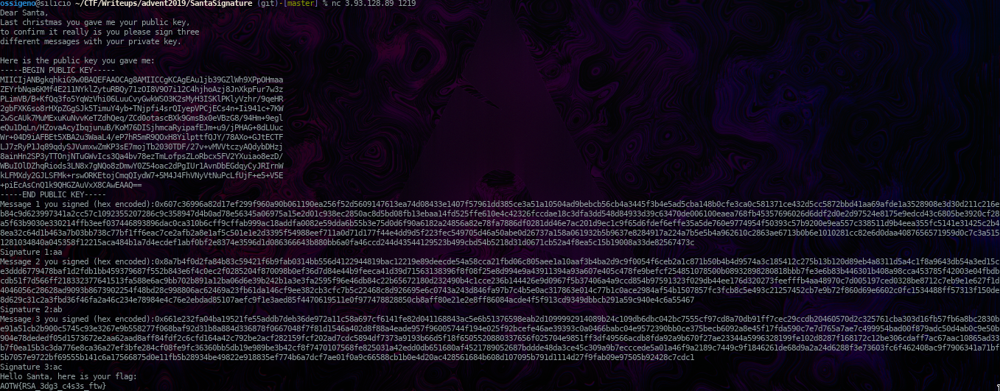

# Santa's Signature
The challenge use a classic RSA sign and verify, without anything strange.

So, differently from the others, I abused the fact that we can give both the Sign and the plaintext as inputs.
Is enought to switch S with M when given as input, where S is calculated encrypting M with the public key that is given.
Since
```Python
verify(m,s):
	return m==encrypt(s,publickey)
```
If we give

```Python
verify(encrypt("AAAA",publicKey),"AAAA") # encrypt("AAAA",publickey)==encrypt("AAAA",publickey) 
```
we will pass the test.
We just have to do this for 3 times!



After reading the explanation by the OverTheWire team, I don't think this was intended, but hey, a flag is a flag.
