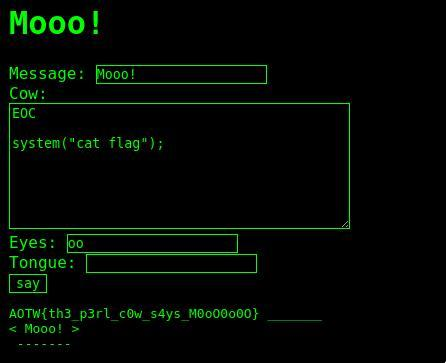

# mooo
The challenge allows the use of cowsay on a website.
You can create a custom one, if you select 'custom' from the input list, meaning that you want to write a custom file that will be executed from cowsay with the '-f' parameter.
So the only things that I can work with is the body had to work with the body, but every command inside was not executed, just printed.
Then I started to read the [source code](https://github.com/schacon/cowsay/blob/master/cowsay)
I searched for the execution of a cowfile, since it was our case, and a line got my attention:
```Perl
177 - do $full;
```
where $full is the path of our cowfile.
It execute the file as if it was Perl!
Then I started to read a cowfile, and the solution was obvious. 
It reads the file till 'EOC', and after that we can inject our code that will be executed.
 So we can just give as input
```Perl
EOC
system("cat flag");
```
and we will get the flag!

