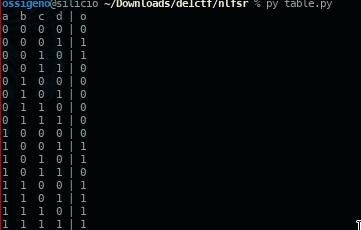

# NLFSR

## Information
- category: crypto
- points: 235

## Description
Easy lfsr easy crypto

链接：https://share.weiyun.com/5qZbNLR 密码：n9huwc https://drive.google.com/open?id=1a5GMVZ77CM1rOrayKJcV3UvMwAy-uGsg


## Writeup
First of all, I solved this challenge with [meowmeowxw](https://meowmeowxw.gitlab.io/)

To understand how a general nlsr works, please read this [article](https://ctf-wiki.github.io/ctf-wiki/crypto/streamcipher/fsr/nfsr/) from ctfwiki.
What did we learn from that article? That we must find a strong correlation between the output and one of the input.
So we made a little script to retrieve the truth table of 
```py 
(ao * bo) ^ (bo * co) ^ (bo * do) ^ co ^ do
```

The table retrieved is the following:





Is possible to see that the parameter A has a strong correlation with the output (75% of times, if A=0 then the output is 0).
So we can calculate this value using the same approach described in the article mentioned before. I modified it slightly and the result is the following code:

```py

mapA = {
    (0,): 0
}

def lfsr(r, m):
    output = ((r << 1) & 0xffffff) ^ (bin(r & m).count('1') % 2)
    last_bit = (bin(r & m).count('1') % 2)
    return output, last_bit

def guessA(maps: {}, rang, a, data, res):
    ma= 0x505a1
    old_a = a
    for a in rang:
        a = old_a
        good = 0
        total = 0
        for j in range(0, len(data)):
            to_check = ()
            output = int(data[j])
            a, a_bit = lfsr(a, ma)
            to_check += (a_bit, )

            expected_res = maps.get(to_check, None)
            if expected_res is None:
                continue
            if expected_res == output:
                good += 1
            total += 1
        if total != 0:
            ratio = good * 100 / total
            if ratio >= 70:
                res.append(var)

    return sorted(res, reverse=True)

```
This function will return the values of every number that has a correlation greater than 70, and only the value 363445 has this property
Now we can retrieve the value of B. This is possible because, reading the truth table, if we know the value of A, and the output O, it is possible to bruteforce the value B having as constraints:
- If A is 1 and the output is 1, B must be 1.
- If A is 0 and the output is 0, B must be 1.


Again only 1 value comply with the constraints.
At this point, we tried to find a correlation with C and D, having A,B and output. But we did not find any correlation, so we decided to bruteforce something.
Since D are only ~40 values, we can try every value of D and use the complete truth table to retrieve the value of C for that particular D.
Of course the last possible value of D was the right one, and thank to that we find the valid value for C.

This is the final script used for retrieve the 4 values:
```py
#!/usr/bin/env python3

from multiprocessing import Process, Manager

n4 = 6
n3 = 13
n2 = 19
n1 = 19


def lfsr(r, m):
    output = ((r << 1) & 0xffffff) ^ (bin(r & m).count('1') % 2)
    last_bit = (bin(r & m).count('1') % 2)
    return output, last_bit


def combine(ao, bo, co, do):
    return (ao * bo) ^ (bo * co) ^ (bo * do) ^ co ^ do


def chunkIt(seq, num):
    avg = len(seq) / float(num)
    out = []
    last = 0.0

    while last < len(seq):
        out.append(seq[int(last):int(last + avg)])
        last += avg

    return out


def start_one(maps: {}, find, a=None, b=None, c=None, d=None, statistic=False):
    res = "Testing"
    if a is not None:
        res += " a " + str(a)
    if b is not None:
        res += " b " + str(b)
    if c is not None:
        res += " c " + str(c)
    if d is not None:
        res += " d " + str(d)
    res += "\nFinding " + find
    # print(res)
    thread = 4
    num = 300
    data = open('./data').read(num)
    if find == "a":
        ansn = range(pow(2, n1 - 1), pow(2, n1))
    elif find == "b":
        ansn = range(pow(2, n2 - 1), pow(2, n2))
    elif find == "c":
        ansn = range(pow(2, n3 - 1), pow(2, n3))
    elif find == "d":
        ansn = range(pow(2, n4 - 1), pow(2, n4))
    else:
        raise
    ranges = chunkIt(ansn, thread)
    manager = Manager()
    return_list = manager.list()
    ps = []
    for i in range(thread):
        ps.append(Process(target=guessOne, args=(maps, ranges[i], a, b, c, d, find, statistic, data, return_list)))
    for p in ps:
        p.start()
    for p in ps:
        p.join()
    return return_list


def guessOne(maps: {}, rang, a, b, c, d, find, statistic, data, res):
    ma, mb, mc, md = 0x505a1, 0x40f3f, 0x1f02, 0x31
    old_a = a
    old_b = b
    old_c = c
    old_d = d
    for var in rang:
        a = old_a
        b = old_b
        c = old_c
        d = old_d
        if find == "a":
            a = var
        elif find == "b":
            b = var
        elif find == "c":
            c = var
        elif find == "d":
            d = var
        else:
            raise
        good = 0
        total = 0
        flag = True
        for j in range(0, len(data)):
            to_check = ()
            output = int(data[j])
            if a is not None:
                a, a_bit = lfsr(a, ma)
                to_check += (a_bit, )
                # to_check = (0, )
            if b is not None:
                b, b_bit = lfsr(b, mb)
                to_check += (b_bit, )
                # to_check = (0, 1)
            if c is not None:
                c, c_bit = lfsr(c, mc)
                to_check += (c_bit,)
            if d is not None:
                d, d_bit = lfsr(d, md)
                to_check += (d_bit,)

            expected_res = maps.get(to_check, None)
            if expected_res is None:
                continue
            if statistic:
                if expected_res == output:
                    good += 1
                total += 1
            else:
                if expected_res != output:
                    flag = False
        if statistic:
            if total != 0:
                ratio = good * 100 / total
                if ratio >= 70:
                    res.append(var)
        else:
            if flag:
                res.append(var)

    return sorted(res, reverse=True)


mapA = {
    (0,): 0
}

mapAB = {
    (0, 1): 0,
    (1, 1): 1
}

mapABC = {
    (0, 1, 0): 0,
    (0, 1, 1): 0,
    (1, 1, 0): 1,
    (1, 1, 1): 1
}
mapABCD = {
    (0, 0, 0, 0): 0,
    (0, 0, 0, 1): 1,
    (0, 0, 1, 0): 1,
    (0, 0, 1, 1): 0,
    (0, 1, 0, 0): 0,
    (0, 1, 0, 1): 0,
    (0, 1, 1, 0): 0,
    (0, 1, 1, 1): 0,
    (1, 0, 0, 0): 0,
    (1, 0, 0, 1): 1,
    (1, 0, 1, 0): 1,
    (1, 0, 1, 1): 0,
    (1, 1, 0, 0): 1,
    (1, 1, 0, 1): 1,
    (1, 1, 1, 0): 1,
    (1, 1, 1, 1): 1,
}

R1 = start_one(mapA, find="a", statistic=True)
if R1:
    print("A: " + " ".join([str(a) for a in R1]))
    for a in R1:
        R2 = start_one(mapAB, find="b", a=a, statistic=False)
        print(R2)
        if R2:
            for b in R2:
                for d in range(32, 64):
                    R3 = start_one(mapABCD, find="c", a=a, b=b, d=d, statistic=False)
                    print(d, R3)
```
The values were: A=363445, B=494934, C=4406, D=63.
